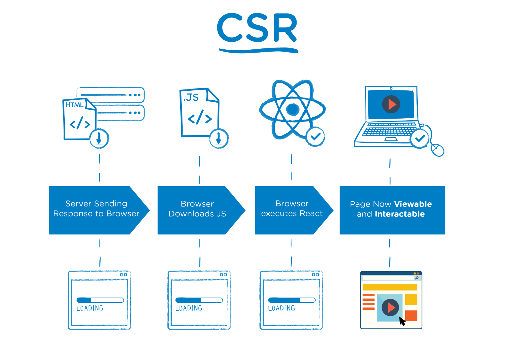

# Universal Rendering

*Also called Universal JavaScript.*

Rendering the views of the application from the server (during the initialisation of the app) an then keep rendering the other views directly in the browser (avoiding a full page refresh).

Usually uses Node.js, Express.js and React.js

Allows a better first load performance as loading the page the first time does not require to wait for the JS to be loaded in the browser.

*Server-side rendering:*
*You can use this method to generate HTML on the server and send the markup down on the initial request for faster page loads and to allow search engines to crawl your pages for SEO purposes.*

*source: [https://medium.com/walmartlabs/the-benefits-of-server-side-rendering-over-client-side-rendering-5d07ff2cefe8](https://medium.com/walmartlabs/the-benefits-of-server-side-rendering-over-client-side-rendering-5d07ff2cefe8)*